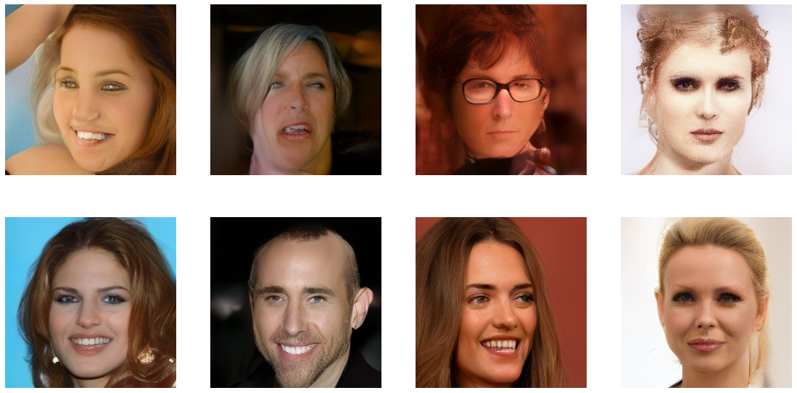

# face-diffusion

In this project, I delve into the realm of diffusion models, which have gained considerable popularity in image generation. However, there is a limitation in unconditional diffusion models — they lack precise control over generated images. To overcome this, I implemented a conditional diffusion model, using various image attributes such as skin tone, hair color, age, and gender for nuanced image generation. The ultimate goal is to achieve precise control over generated images, particularly in terms of object poses and attributes. I begin by constructing an unconditional diffusion model for high-quality random face image generation and then modify it to incorporate face attribute vectors for generating controlled images. Experiments are conducted on MNIST and CelebA datasets, with results reported to showcase the efficacy of the approach. Unlike previous models that rely on complex architectures and supplementary attributes, my approach streamlines the process for one-step image generation based solely on the attributes of a given facial image.

The key contributions of this work are the following:
* We develop a diffusion model from scratch, conditioned on image attributes
* We evaluate our model on MNIST and CelebA datasets, demonstrating smooth interpolation through
editing image attributes
* We compare the performance of the unconditional model to conditional model, attaining a
4% increase in FID

_Refer to the final report and project presentation for more details_

## Model Architecture

We implement the Denoising Diffusion Probabilistic Models (DDPM) [HJA20] paper and implement the classifier free guidance [HS22] technique to include the attribute information throughout the image generation process.

The base architecture is of a U-Net that utilizes ResNet blocks and self-attention modules. Figure 1 depicts the basic framework of the model architecture. The details of the DDPM model is further explained in Figure 2

## Results
### Unconditional Image Generation

<figure>
  
  
  
  <figcaption>Randomly generated images of DDPM when trained on CelebA dataset</figcaption>
</figure>

### Attribute Conditioned Image Generation

The conditional image generation results show us that the model is successfully able to associate different face attributes in its image generation process. For example, in this particular interpolation, we can see that adding facial attributes (such as eyeglasses, beard and inverting male-female etc.) results in successful guided image generation.

## Conclusion

This particular project in Computer Vision brought together a plethora of emotions. What initially started as an HOI image generation project, went more into facial image editing. The primary challenge in this project was training the model from scratch. We realized that training is expensive (time and resources), that increases exponentially with model parameter increase. Also, specialized applications require a unique model architecture, so pre-trained weights are not always available, especially when attempting HOI synthesis.

The primary contributions/learning from this project are the following:

* Implemented and explored the core diffusion model architecture and experimented with different possibilities of achieving guided image generation
* Developed a complete conditional image generation pipeline from scratch. The generated face images for CelebA are of good quality
* Demostrated smooth interpolation between image attributes – an improvement of this model can lead to various downstream application in GenAI, including image editing

Moving ahead, I would like to attempt the HOI synthesis project in future. I would like to explore our initial hypothesis that "A simple diffusion model with object pose embeddings as the conditional data can be the solution to complex model architectures and will generalize better in HOI synthesis tasks".

